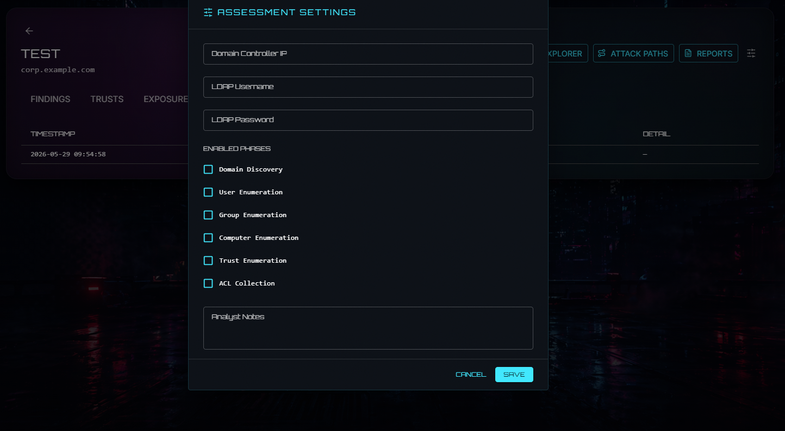
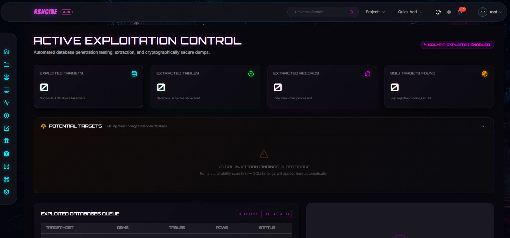

<p align="center">

</p>

# reNgine v3 Plugin Development Guide

<p align="center">
  
</p>

reNgine v3 introduces a modular plugin architecture that lets developers extend the platform's capabilities without modifying the core codebase. Plugins can add backend pipelines, Temporal workflows, and full UI pages.

---

## Plugin Anatomy

A reNgine plugin is a directory (packaged as a ZIP for distribution) with the following structure:

```text
my-plugin/
├── manifest.yaml           # Required — identity, pipeline hooks, UI config
├── tools.yaml              # Optional — binary tool dependencies
├── my_engine.yaml          # Optional — Django fixture for engine templates
├── backend/                # Optional — Django app (models, API, Temporal workflows)
│   ├── __init__.py
│   ├── models.py
│   ├── api.py
│   ├── api_urls.py         # Registers routes at /api/plugins/{slug}/
│   ├── serializers.py
│   ├── migrations/
│   └── temporal_exports.py # Temporal workflow + activity definitions
└── ui/                     # Optional — frontend UI source (Vite lib build)
    ├── package.json
    ├── vite.config.ts
    ├── tsconfig.json
    └── src/
        ├── index.ts        # Barrel — named exports of all page components
        ├── api/            # TanStack Query hooks
        ├── store/          # Zustand state
        ├── hooks/          # Custom React hooks (WebSocket, etc.)
        ├── components/     # Shared UI components
        └── pages/          # Full page components
```

---

## The Manifest (`manifest.yaml`)

`manifest.yaml` is the source of truth for your plugin.

```yaml
slug: "my_plugin"
name: "My Plugin"
version: "1.0.0"
description: "What this plugin does."
author: "Your Name"

runtime:
  run_after: "VulnerabilityScan"   # Core scan step to run after

temporal:
  activities:
    - "backend.temporal_exports.my_activity"
    - "backend.temporal_exports.another_activity"

ui:
  menu_item: "My Plugin"           # Label in the "Plugins" nav group
  menu_path: "/my-plugin"          # Sub-path under /{projectSlug}/
```

### Sequencing Anchors

```
SubdomainDiscovery | PortScan | FetchURL | VulnerabilityScan | Reporting
```

---

## Backend Development

### Django App

A plugin backend is a standard Django app installed into `plugins_data/{slug}/backend/` at install time. The dynamic URL loader in `api/urls.py` auto-discovers `backend/api_urls.py` and mounts it at `/api/plugins/{slug}/`.

```python
# backend/api_urls.py
from django.urls import path
from rest_framework import routers
from .api import MyViewSet

router = routers.DefaultRouter()
router.register(r'items', MyViewSet, basename='items')
urlpatterns = router.urls
```

### Temporal Workflows

Define activities in `backend/temporal_exports.py` and list them in `manifest.yaml temporal.activities`. The Temporal orchestrator discovers and registers them on startup.

```python
# backend/temporal_exports.py
from temporalio import activity

@activity.defn(name="my_plugin_activity")
async def my_activity(params: dict) -> dict:
    ...
    return {"status": "done"}
```

---

## UI Development — Two Patterns

There are two ways to add UI from a plugin:

| Pattern | Use case | Example |
|---------|----------|---------|
| **Component override** | Replace an existing core component | `custom_vuln_badge` overrides `VulnerabilityBadge` |
| **New pages** | Add entirely new pages with nav link | `erl_temporal` adds Exploit Readiness Dashboard pages |

Both patterns use the same Vite lib build. The difference is how the host integrates the output.

---

## Pattern 1: Component Overrides (ERL Style)

Use this when you want to replace an existing component in the core UI.

### `manifest.yaml`

```yaml
ui:
  overrides:
    - name: "VulnerabilityTable"
      file: "VulnerabilityTable.js"
```

### `vite.config.ts`

```typescript
import { defineConfig } from 'vite';
import react from '@vitejs/plugin-react';

export default defineConfig({
  plugins: [react()],
  build: {
    lib: {
      entry: 'src/VulnerabilityTable.tsx',
      name: 'VulnerabilityTable',
      fileName: 'VulnerabilityTable',
      formats: ['es'],
    },
    rollupOptions: {
      external: ['react', 'react-dom', '@mui/material', 'lucide-react'],
    },
    outDir: 'dist',
  },
});
```

The built file (`dist/VulnerabilityTable.js`) must have a **default export** — the host's `PluginComponentLoader` uses `module.default`.

---

## Pattern 2: New Pages (PluginPageLoader Style)

Use this when your plugin adds entirely new pages that need their own routes.

### Step 1: Set up `vite.config.ts` with a barrel entry

```typescript
import { defineConfig } from 'vite';
import react from '@vitejs/plugin-react';

export default defineConfig({
  plugins: [react()],
  build: {
    lib: {
      entry: 'src/index.ts',   // Barrel that exports all page components by name
      name: 'MyPlugin',
      fileName: 'index',        // Output: dist/index.js
      formats: ['es'],
    },
    rollupOptions: {
      // Mark host-provided deps as external (NOT bundled)
      external: [
        'react', 'react-dom',
        '@mui/material', '@mui/material/styles', '@mui/icons-material',
        'lucide-react',
      ],
    },
    outDir: 'dist',
    emptyOutDir: true,
  },
});
```

### Step 2: Export all pages from `src/index.ts`

```typescript
// src/index.ts
export { MyListPage }   from './pages/MyListPage';
export { MyDetailPage } from './pages/MyDetailPage';
```

Each page is a **named export**. The host loads by name via `PluginPageLoader`.

### Step 3: Write page components

Page components receive props passed by the host route. Use `assessmentId`, `projectSlug`, or whatever the route provides.

```typescript
// src/pages/MyListPage.tsx
import React from 'react';

interface Props {
  projectSlug?: string;
}

export function MyListPage({ projectSlug }: Props) {
  return <div>My Plugin page for project: {projectSlug}</div>;
}
```

### Step 4: Add `manifest.yaml` menu config

```yaml
ui:
  menu_item: "My Plugin"        # Nav label shown under "Plugins"
  menu_path: "/p/my_plugin"     # Mapped to the dynamic route /{projectSlug}/p/{slug}
  entry_export: "MyListPage"    # Named export from dist/index.js representing the entry page
```

When the plugin is enabled, the Shell reads `/api/plugins/registry/` and adds a nav link to `/{projectSlug}/p/my_plugin`.

### Step 5: Standardized Dynamic Routes

The host system includes pre-defined generic routes to load plugin pages dynamically. This removes the need to hardcode router modifications for each new plugin page:

* **Plugin Main Entry Route (`/{projectSlug}/p/$pluginSlug`)**:
  Automatically resolves the active plugin, reads its `entry_export` property, and loads it.
  
* **Plugin Subpage Route (`/{projectSlug}/p/$pluginSlug/$pageName`)**:
  Loads the named export component `$pageName` from the plugin barrel file. This allows plugin developers to define as many nested routes as they need (e.g. `/p/my_plugin/MyDetailPage`).

Dynamic page routing works automatically out-of-the-box for any installed plugin.


---

## PluginPageLoader Reference

`PluginPageLoader` is a host-side React component that dynamically loads a named export from a plugin's built ES module.

```typescript
// frontend/src/features/plugins/components/PluginPageLoader.tsx

interface Props {
  pluginSlug: string;   // e.g. "active_directory"
  exportName: string;   // Named export from dist/index.js, e.g. "ADAssessmentsPage"
  [key: string]: unknown;  // Additional props forwarded to the loaded component
}
```

**How it works:**

1. On mount, it `import()`-s `/media/plugins/{slug}/ui/index.js` (a cache-busted dynamic import)
2. It looks up `module[exportName]` — the named export
3. If found and it's a function, it renders it with all extra props forwarded
4. Shows a `CircularProgress` spinner while loading
5. Shows an error message if the module fails to load or the export is not found

**The plugin is served from `MEDIA_ROOT`** — this happens automatically when you install from the marketplace or upload a zip. The `AtomicInstaller` copies `ui/dist/` to `MEDIA_ROOT/plugins/{slug}/ui/` as part of installation.

> **Note:** The `sync_plugin_ui` management command exists for emergency re-sync only (e.g. after a manual file restore). Normal marketplace installs do not require it.

---

## Build Pipeline

```
Source: r3ngine-plugins/{slug}/ui/src/
         ↓
Build:   npm run build  (or build_plugins.py)
         ↓
Output:  r3ngine-plugins/{slug}/ui/dist/index.js
         ↓
Package: build_plugins.py  →  dist/{slug}.zip
         ↓
Install: AtomicInstaller  →  plugins_data/{slug}/  +  MEDIA_ROOT/plugins/{slug}/ui/
         ↓
Served:  /media/plugins/{slug}/ui/index.js
```

### Building with `build_plugins.py`

```bash
# Build and package a single plugin
cd r3ngine-plugins
python build_plugins.py active_directory

# Build all plugins
python build_plugins.py
```

### Building the UI directly (for development)

```bash
cd r3ngine-plugins/active_directory/ui
npm install
npm run build
```

---

## Full Example: Active Directory Intelligence Plugin

The `active_directory` plugin is the reference implementation of the new-pages pattern.

**Backend:** Django app with models (`ADAssessment`, `ADFinding`, `ADTrust`, `ADExposure`), REST API at `/api/plugins/active_directory/`, Temporal workflow with 8 activities, Neo4j graph manager.

**Frontend pages (exported from `ui/src/index.ts`):**

| Export name | Route | Description |
|-------------|-------|-------------|
| `ADAssessmentsPage` | `/{slug}/active-directory` | Assessment list with create/start actions |
| `ADAssessmentDetailPage` | `/{slug}/active-directory/assessment/$id` | Findings, trusts, exposures tabs + ingest |
| `ADGraphExplorerPage` | `/{slug}/active-directory/assessment/$id/graph` | Interactive Cytoscape domain graph |
| `ADTrustAnalyticsPage` | `/{slug}/active-directory/assessment/$id/trusts` | Trust relationship table |
| `ADExposureDashboardPage` | `/{slug}/active-directory/assessment/$id/exposures` | Risk-scored exposure surface |

**Key dependencies bundled into `dist/index.js`:**
- `cytoscape` + `react-cytoscapejs` (graph visualization)
- `zustand` (UI state)
- `@tanstack/react-query` (data fetching)

**Peer dependencies provided by host (NOT bundled):**
- `react`, `react-dom`
- `@mui/material`, `@mui/icons-material`
- `lucide-react`

---

## `package.json` Guidelines

```json
{
  "peerDependencies": {
    "react": "^18.0.0",
    "react-dom": "^18.0.0",
    "@mui/material": "^6.0.0",
    "@mui/icons-material": "^6.0.0",
    "lucide-react": "^0.400.0"
  },
  "dependencies": {
    "@tanstack/react-query": "^5.100.9",
    "zustand": "^5.0.0",
    "cytoscape": "^3.33.3"
  },
  "devDependencies": {
    "vite": "^5.0.0",
    "@vitejs/plugin-react": "^4.0.0",
    "typescript": "^5.0.0"
  }
}
```

- `peerDependencies` → listed in `rollupOptions.external` → provided by host at runtime, not bundled
- `dependencies` → bundled into `dist/index.js`
- Do NOT add `react` or `@mui/material` to `dependencies` — the host provides one instance; bundling another causes React hook errors

---

## Development Workflow

1. **Write source locally** — all plugin code lives in `r3ngine-plugins/{slug}/` on your host machine
2. **Build the UI** — `cd r3ngine-plugins/{slug}/ui && npm run build`
3. **Sync to container** — `docker cp r3ngine-plugins/{slug} r3ngine-web-1:/usr/src/app/plugins_data/`
4. **Sync UI to media** — `docker exec r3ngine-web-1 python manage.py sync_plugin_ui`
5. **Test in browser** — navigate to `/{projectSlug}/my-plugin`
6. **Commit** — plugin files to `r3ngine-plugins/` repo; host route changes to the main `r3ngine` repo

> Never commit `web/plugins_data/` to any repo — it is runtime install state only.

---

## Tool Dependencies (`tools.yaml`)

```yaml
tools:
  - name: "my-tool"
    binary: "my-tool"
    install_type: "pip3"
    install_command: "pip3 install my-tool"
    validation_command: "my-tool --version"
```

Tools are installed into `plugins_data/{slug}/` on the worker container.

---

## Tips

- Check `reNgine.opsec_utils` for proxy rotation and stealth utilities
- Use `_send_ws_update(assessment_id, type, payload)` in Temporal activities to push real-time progress via WebSocket
- WebSocket endpoint for plugins: `ws[s]://{host}/ws/plugins/{slug}/{assessment_id}/`
- All data fetching in plugin UI should use `credentials: 'include'` to pass session cookies


# Active Directory Plugin
<p align="center">
  
</p>

# Exploit Readiness Layer Plugin
<p align="center">
  
</p>

# Active Exploitation Plugin
<p align="center">
  
</p>

# Burp Suite Professional Integration Plugin
<p align="center">
  <!--  -->
</p>

# Credential Intelligence Plugin
Advanced authentication testing and password auditing via brutus, netexec, kerbrute, and hashcat.
<p align="center">
  <!--  -->
</p>

# Email Security Plugin
SMTP open relay, user enumeration, STARTTLS, and SPF/DKIM/DMARC policy checks. Runs automatically after Tier 2 port scanning.
<p align="center">
  <!--  -->
</p>
