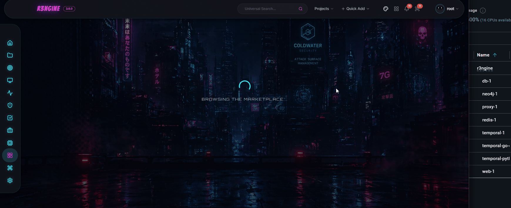

<p align="center">

</p>

# reNgine v3 Plugin Development Guide

<p align="center">
  
</p>

reNgine v3 introduces a modular plugin architecture that lets developers extend the platform's capabilities without modifying the core codebase. Plugins can:

- Add new Django models and REST API endpoints
- Register Temporal workflows and activities for scan pipeline integration
- **Inject tasks into the scan pipeline at any tier** (`tier_1` through `tier_7`, or `standalone`)
- Serve a React UI via Vite Module Federation (loaded dynamically by `PluginPageLoader`)
- Install external security tools at container startup via `tools.yaml`

---

## Plugin Anatomy

A reNgine plugin is a directory (packaged as a custom signed ZIP [.r3n] for distribution) with the following structure:

```text
my-plugin/
├── manifest.yaml           # Required — identity, pipeline hooks, UI config
├── tools.yaml              # Optional — binary tool dependencies
├── my_engine.yaml          # Optional — Django fixture for engine templates
├── backend/                # Optional — Django app (models, API, Temporal workflows)
│   ├── __init__.py
│   ├── models.py
│   ├── api.py
│   ├── api_urls.py         # Registers routes at /api/plugins/{slug}/
│   ├── serializers.py
│   ├── migrations/
│   └── temporal_exports.py # Temporal workflow + activity definitions
└── ui/                     # Optional — frontend UI source (Vite lib build)
    ├── package.json
    ├── vite.config.ts
    ├── tsconfig.json
    └── src/
        ├── index.ts        # Barrel — named exports of all page components
        ├── api/            # TanStack Query hooks
        ├── store/          # Zustand state
        ├── hooks/          # Custom React hooks (WebSocket, etc.)
        ├── components/     # Shared UI components
        └── pages/          # Full page components
```

---

## The Manifest (`manifest.yaml`)

`manifest.yaml` is the source of truth for your plugin.

```yaml
name: "My Plugin"
version: "1.0.0"
author: "Your Name"
icon: "icon.png"
description: "What this plugin does."

runtime:
  run_after: "VulnerabilityScan"   # Core scan step to run after options are run_before, run_after, standalone

temporal:
  workflows:
    - "backend.temporal_exports.my_workflow"
  activities:
    - "backend.temporal_exports.my_activity"
    - "backend.temporal_exports.another_activity"

ui:
  menu_item: "My Plugin"           # Label in the "Plugins" nav group
  menu_path: "/my-plugin"          # Sub-path under /{projectSlug}/
  entry_export: "MyPluginExport"
```

### Sequencing Anchors

```
SubdomainDiscovery | PortScan | FetchURL | VulnerabilityScan | Reporting
```

---

## Backend Development

### Django App

A plugin backend is a standard Django app installed into `plugins_data/{slug}/backend/` at install time. The dynamic URL loader in `api/urls.py` auto-discovers `backend/api_urls.py` and mounts it at `/api/plugins/{slug}/`.

```python
# backend/api_urls.py
from django.urls import path
from rest_framework import routers
from .api import MyViewSet

router = routers.DefaultRouter()
router.register(r'items', MyViewSet, basename='items')
urlpatterns = router.urls
```

### Temporal Workflows

Define activities in `backend/temporal_exports.py` and list them in `manifest.yaml temporal.activities`. The Temporal orchestrator discovers and registers them on startup.

```python
# backend/temporal_exports.py
from temporalio import activity

@activity.defn(name="my_plugin_activity")
async def my_activity(params: dict) -> dict:
    ...
    return {"status": "done"}
```

---

## UI Development — Two Patterns

There are two ways to add UI from a plugin:

| Pattern | Use case | Example |
|---------|----------|---------|
| **Component override** | Replace an existing core component | `custom_vuln_badge` overrides `VulnerabilityBadge` |
| **New pages** | Add entirely new pages with nav link | `erl_temporal` adds Exploit Readiness Dashboard pages |

Both patterns use the same Vite lib build. The difference is how the host integrates the output.

---

## Pattern 1: Component Overrides (ERL Style)

Use this when you want to replace an existing component in the core UI.

### `manifest.yaml`

```yaml
ui:
  overrides:
    - name: "VulnerabilityTable"
      file: "VulnerabilityTable.js"
```

### `vite.config.ts`

```typescript
import { defineConfig } from 'vite';
import react from '@vitejs/plugin-react';

export default defineConfig({
  plugins: [react()],
  build: {
    lib: {
      entry: 'src/VulnerabilityTable.tsx',
      name: 'VulnerabilityTable',
      fileName: 'VulnerabilityTable',
      formats: ['es'],
    },
    rollupOptions: {
      external: ['react', 'react-dom', '@mui/material', 'lucide-react'],
    },
    outDir: 'dist',
  },
});
```

The built file (`dist/VulnerabilityTable.js`) must have a **default export** — the host's `PluginComponentLoader` uses `module.default`.

---

## Pattern 2: New Pages via Module Federation (Recommended)

Use this when your plugin adds entirely new pages or complex applications that need their own routes. This pattern leverages Vite Module Federation to dynamically load your app's `mount` point safely inside the host shell.

### Step 1: Set up `vite.config.ts`

Use `@originjs/vite-plugin-federation` to expose a single `mount` module. Avoid sharing dependencies (`shared: []`) to ensure your plugin remains completely decoupled from host versions and avoids dependency clashes.

```typescript
import { defineConfig } from 'vite';
import react from '@vitejs/plugin-react';
import federation from '@originjs/vite-plugin-federation';

export default defineConfig({
  plugins: [
    react(),
    federation({
      name: 'my_plugin',
      filename: 'remoteEntry.js',
      exposes: {
        './mount': './src/mount.tsx',
      },
      shared: []
    })
  ],
  build: {
    target: 'esnext',
    minify: false,
    cssCodeSplit: false,
    outDir: 'dist',
    emptyOutDir: true
  }
});
```

### Step 2: Create the `mount.tsx` integration hook

The host system doesn't render your React tree directly. Instead, it creates an empty `div` and calls your `mount` function, passing it the DOM element and any host context (like the active `projectSlug`).

```typescript
// src/mount.tsx
import { createRoot, Root } from 'react-dom/client';
import App from './App';

let root: Root | null = null;

export const mount = (el: HTMLElement, props: any) => {
    root = createRoot(el);
    root.render(<App {...props} />);
};

export const unmount = (_el: HTMLElement) => {
    if (root) {
        root.unmount();
        root = null;
    }
};
```

### Step 3: Write your `App.tsx`

Now you can build your plugin as a completely standard React application!

```typescript
// src/App.tsx
import React from 'react';

export default function App({ projectSlug }: { projectSlug: string }) {
  return (
    <div>
      <h1>My Plugin Dashboard</h1>
      <p>Active project: {projectSlug}</p>
    </div>
  );
}
```

### Step 4: Add `manifest.yaml` menu config

```yaml
ui:
  menu_item: "My Plugin"        # Nav label shown under "Plugins"
  menu_path: "/my_plugin"       # Mapped to the dynamic route /{projectSlug}/plugins/my_plugin
```

When the plugin is enabled, the core router automatically detects it and renders the Module Federation remote loader.

---

## Build Pipeline

```
Source: r3ngine-plugins/{slug}/ui/src/
         ↓
Build:   npm run build  (or build_plugins.py)
         ↓
Output:  r3ngine-plugins/{slug}/ui/dist/assets/remoteEntry.js
         ↓
Package: build_plugins.py  →  dist/{slug}.zip
         ↓
Install: AtomicInstaller  →  plugins_data/{slug}/  +  MEDIA_ROOT/plugins/{slug}/ui/
         ↓
Served:  /media/plugins/{slug}/ui/assets/remoteEntry.js
```

### Building with `build_plugins.py`

```bash
# Build and package a single plugin
cd r3ngine-plugins
python build_plugins.py active_directory

# Build all plugins
python build_plugins.py
```

### Building the UI directly (for development)

```bash
cd r3ngine-plugins/active_directory/ui
npm install
npm run build
```

---

## Full Example: Active Directory Intelligence Plugin

The `active_directory` plugin is the reference implementation of the new-pages pattern.

**Backend:** Django app with models (`ADAssessment`, `ADFinding`, `ADTrust`, `ADExposure`), REST API at `/api/plugins/active_directory/`, Temporal workflow with 8 activities, Neo4j graph manager.

**Frontend pages (exported from `ui/src/index.ts`):**

| Export name | Route | Description |
|-------------|-------|-------------|
| `ADAssessmentsPage` | `/{slug}/active-directory` | Assessment list with create/start actions |
| `ADAssessmentDetailPage` | `/{slug}/active-directory/assessment/$id` | Findings, trusts, exposures tabs + ingest |
| `ADGraphExplorerPage` | `/{slug}/active-directory/assessment/$id/graph` | Interactive Cytoscape domain graph |
| `ADTrustAnalyticsPage` | `/{slug}/active-directory/assessment/$id/trusts` | Trust relationship table |
| `ADExposureDashboardPage` | `/{slug}/active-directory/assessment/$id/exposures` | Risk-scored exposure surface |

**Key dependencies bundled into `dist/index.js`:**
- `cytoscape` + `react-cytoscapejs` (graph visualization)
- `zustand` (UI state)
- `@tanstack/react-query` (data fetching)

**Peer dependencies provided by host (NOT bundled):**
- `react`, `react-dom`
- `@mui/material`, `@mui/icons-material`
- `lucide-react`

---

## `package.json` Guidelines

```json
{
  "peerDependencies": {
    "react": "^18.0.0",
    "react-dom": "^18.0.0",
    "@mui/material": "^6.0.0",
    "@mui/icons-material": "^6.0.0",
    "lucide-react": "^0.400.0"
  },
  "dependencies": {
    "@tanstack/react-query": "^5.100.9",
    "zustand": "^5.0.0",
    "cytoscape": "^3.33.3"
  },
  "devDependencies": {
    "vite": "^5.0.0",
    "@vitejs/plugin-react": "^4.0.0",
    "typescript": "^5.0.0"
  }
}
```

- `peerDependencies` → listed in `rollupOptions.external` → provided by host at runtime, not bundled
- `dependencies` → bundled into `dist/index.js`
- Do NOT add `react` or `@mui/material` to `dependencies` — the host provides one instance; bundling another causes React hook errors

---

## Development Workflow

1. **Write source locally** — all plugin code lives in `r3ngine-plugins/{slug}/` on your host machine
2. **Build the UI** — `cd r3ngine-plugins/{slug}/ui && npm run build`
3. **Sync to container** — `docker cp r3ngine-plugins/{slug} r3ngine-web-1:/usr/src/app/plugins_data/`
4. **Sync UI to media** — `docker exec r3ngine-web-1 python manage.py sync_plugin_ui`
5. **Test in browser** — navigate to `/{projectSlug}/my-plugin`
6. **Commit** — plugin files to `r3ngine-plugins/` repo; host route changes to the main `r3ngine` repo

> Never commit `web/plugins_data/` to any repo — it is runtime install state only.

---

## Tool Dependencies (`tools.yaml`)

```yaml
tools:
  - name: "my-tool"
    binary: "my-tool"
    install_type: "pip3"
    install_command: "pip3 install my-tool"
    validation_command: "my-tool --version"
```

Tools are installed into `plugins_data/{slug}/` on the worker container.

---

## Tips

- Check `reNgine.opsec_utils` for proxy rotation and stealth utilities
- Use `_send_ws_update(assessment_id, type, payload)` in Temporal activities to push real-time progress via WebSocket
- WebSocket endpoint for plugins: `ws[s]://{host}/ws/plugins/{slug}/{assessment_id}/`
- All data fetching in plugin UI should use `credentials: 'include'` to pass session cookies


# Active Directory Plugin
<p align="center">
  
</p>

# Exploit Readiness Layer Plugin
<p align="center">
  
</p>

# Active Exploitation Plugin
<p align="center">
  
</p>

# Burp Suite Professional Integration Plugin
<p align="center">
  <!--  -->
</p>

# Credential Intelligence Plugin
Advanced authentication testing and password auditing via brutus, netexec, kerbrute, and hashcat.
<p align="center">
  <!--  -->
</p>

# Metasploit Integration Plugin
Standalone Metasploit integration providing a 2-way interactive terminal and automated Temporal-driven template scans.
<p align="center">
  
</p>

# Compliance Assessment Plugin
Post-scan compliance analysis mapping scan artefacts to PCI-DSS 4.0, HIPAA, NIST SP 800-53, CIS Controls v8, ISO 27001, and SOC 2 controls. Runs automatically after Tier 7.
<!-- <p align="center">
  
</p> -->
