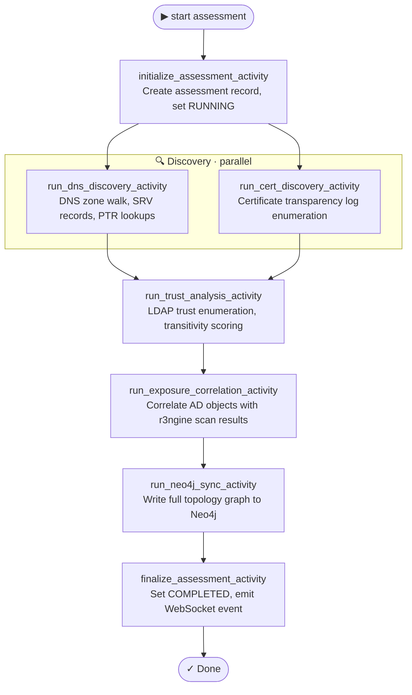

<p align="center">
<a href="https://rengine.wiki"></a>
</p>

<p align="center">
  <h4 align="center"><strong>r3ngine Plugin · Active Directory Intelligence</strong></h4>
  <h3 align="center">Enterprise AD Attack Surface Analysis, BloodHound Path Discovery & Identity Exposure Management</h3>
</p>

<p align="center">
  <a href="#" target="_blank">
    
  </a>
  &nbsp;
  <a href="#" target="_blank">
    
  </a>
  &nbsp;
  <a href="#" target="_blank">
    
  </a>
  &nbsp;
  <a href="https://www.gnu.org/licenses/gpl-3.0" target="_blank">
    
  </a>
</p>


## About

The **Active Directory Intelligence** plugin is a dedicated, standalone assessment environment for enterprise Active Directory environments. It is purpose-built for contracted penetration testing and security consulting engagements — it never runs as part of the core web reconnaissance pipeline.

The plugin provides an end-to-end workflow: ingest BloodHound JSON exports or run live LDAP enumeration, build a semantic Neo4j graph of your AD topology, query attack paths, enumerate vulnerable configurations, and generate professional reports — all from within the r3ngine interface.


## Table of Contents

* [Features](#features)
* [Tools & Dependencies](#tools--dependencies)
* [Graph Model](#graph-model)
* [Attack Path Queries](#attack-path-queries)
* [REST API](#rest-api)
* [Temporal Workflow](#temporal-workflow)
* [Configuration](#configuration)
* [UI Overview](#ui-overview)
* [Building the UI](#building-the-ui)


## Features

### 🧠 AD Intelligence & Graph Engine
*   **Semantic Neo4j Graph**: All AD objects (Domains, Forests, OUs, Users, Groups, Computers, Trusts, Subnets, Certificates, Policies, Exposures) stored as a typed graph with `AD_`-prefixed labels to avoid collision with the core r3ngine graph.
*   **BloodHound JSON Ingestion**: Parse BloodHound CE exports to populate users, computers, groups, ACL edges, SPNs, and delegation targets into the graph in one operation.
*   **Live LDAP Enumeration**: Active LDAP discovery via `ldapdomaindump` and `impacket` for environments without an existing BloodHound export.
*   **Trust Analysis**: Full domain trust topology enumeration with transitive chain detection and per-trust risk scoring.
*   **Exposure Correlation**: Correlates AD objects with internet-facing hosts identified by the core r3ngine scan pipeline.

### 🎯 Attack Path Discovery
*   **Domain Admin Paths** (`da_paths`): Shortest path queries from any standard user to Domain Admins via `AD_MEMBER_OF` traversal.
*   **Kerberoastable Accounts**: Identifies users with registered SPNs (`kerberoastable=true`) that are vulnerable to offline password cracking.
*   **AS-REP Roastable Accounts**: Identifies accounts with Kerberos pre-authentication disabled (`dont_req_preauth=true`).
*   **Unconstrained Delegation**: Identifies computers configured for unconstrained Kerberos delegation — an attacker who compromises these can forge tickets for any user.
*   **ACL Abuse Paths**: Enumerates dangerous ACL edges (`GenericAll`, `WriteDACL`, `WriteOwner`, `ForceChangePassword`, `HasSession`, `AdminTo`, `AllowedToDelegate`) between non-admin principals and high-value targets.

### 📊 Reporting & Evidence
*   **7-Section Intelligence Reports**: Executive summary, domain inventory, trust topology, exposure analysis, attack paths, and recommendations.
*   **Dual Format Export**: JSON (machine-readable) and PDF (`cyber_pro` / `ad_modern` templates).
*   **Immutable Evidence Log**: All assessment actions (ingest, start, cancel, config changes) are written to an append-only evidence log with actor and timestamp.
*   **RBAC**: Assessment actions require the `can_run_ad_assessment` permission.

### 📡 Real-Time Streaming
*   **WebSocket Events**: Assessment progress events streamed through Django Channels + Redis with 150 ms client-side batching.
*   **Live Graph Updates**: Node and edge counts pushed to the UI as ingestion completes.


## Tools & Dependencies

| Tool | Purpose | Install |
|------|---------|---------|
| `ldapdomaindump` | Live LDAP enumeration — dumps users, groups, computers, trusts to JSON | `pip3 install ldapdomaindump` |
| `impacket` | AD protocol toolkit — used for LDAP, Kerberos, and SMB operations | `pip3 install impacket` |
| **BloodHound CE** | Graph-based AD attack path platform; plugin consumes its JSON exports | External — see `neo4j_bolt_url` config |
| **Neo4j** | Graph database backing the AD topology and attack path Cypher queries | Provided by r3ngine Docker Compose stack (`neo4j:7687`) |

Tools are registered in [`tools.yaml`](tools.yaml) and installed automatically by the r3ngine plugin loader at container startup. No manual installation is required.


## Graph Model

All nodes and relationships use `AD_`-prefixed labels to namespace them away from the core graph.

### Node Types

| Label | Represents |
|-------|-----------|
| `ADDomain` | Active Directory domain |
| `ADForest` | AD forest root |
| `ADOU` | Organisational Unit |
| `ADUser` | Domain user account |
| `ADGroup` | Security / distribution group |
| `ADComputer` | Domain-joined computer |
| `ADService` | Service account |
| `ADCertificate` | Certificate template |
| `ADTrust` | Cross-domain trust |
| `ADSubnet` | IP subnet |
| `ADSite` | AD site |
| `ADPolicy` | Group Policy Object |
| `ADExposure` | Internet-exposed AD-correlated host |

### Relationship Types

| Relationship | Meaning |
|-------------|---------|
| `AD_MEMBER_OF` | User / computer group membership |
| `AD_TRUSTS` | Domain trust link |
| `AD_CONNECTED_TO` | Network connectivity |
| `AD_AUTHENTICATES_TO` | Kerberos / LDAP auth target |
| `AD_EXPOSES` | AD object ↔ external exposure |
| `AD_GENERIC_ALL` | Full control ACE |
| `AD_WRITE_DACL` | Ability to rewrite ACL |
| `AD_WRITE_OWNER` | Ownership modification right |
| `AD_FORCE_CHANGE_PW` | Password reset right |
| `AD_HAS_SESSION` | Active user session on computer |
| `AD_ADMIN_TO` | Local administrator right |
| `AD_ALLOWED_TO_DELEGATE` | Kerberos constrained delegation target |


## Attack Path Queries

The `ADGraphManager` exposes five Cypher-backed query methods, each returning plain Python dicts that are serialised directly by the `attack-paths` API action.

```
find_da_paths(assessment_id, max_hops)
    → shortestPath from any ADUser → Domain Admins ADGroup via AD_MEMBER_OF

find_kerberoastable(assessment_id)
    → ADUser nodes where kerberoastable = true

find_asreproastable(assessment_id)
    → ADUser nodes where dont_req_preauth = true

find_unconstrained_delegation(assessment_id)
    → ADComputer nodes where unconstrained_delegation = true

find_acl_abuse(assessment_id)
    → non-privileged principals with dangerous ACL edges to admin objects
```

All methods are non-fatal — if Neo4j is unavailable they return an empty list and log a warning rather than raising an exception.


## REST API

All endpoints are mounted under `/api/plugins/active_directory/`.

| Method | Endpoint | Description |
|--------|----------|-------------|
| `GET` | `assessments/` | List all assessments |
| `POST` | `assessments/` | Create new assessment |
| `GET` | `assessments/{id}/` | Retrieve assessment detail |
| `PATCH` | `assessments/{id}/` | Update per-assessment config |
| `POST` | `assessments/{id}/start/` | Launch Temporal workflow |
| `POST` | `assessments/{id}/cancel/` | Cancel running workflow |
| `GET` | `assessments/{id}/findings/` | Paginated findings (50/page), filterable by `severity` |
| `GET` | `assessments/{id}/trusts/` | Domain trust enumeration |
| `GET` | `assessments/{id}/exposures/` | Internet-facing exposure records |
| `GET` | `assessments/{id}/graph/domains/` | Cytoscape-format domain graph (`?limit=0` for full load) |
| `GET` | `assessments/{id}/graph/exposures/` | Cytoscape-format exposure graph |
| `GET` | `assessments/{id}/attack-paths/` | Attack path results — `?category=` one of: `da_paths`, `kerberoastable`, `asreproastable`, `unconstrained_delegation`, `acl_abuse` |
| `POST` | `assessments/{id}/ingest/` | Upload BloodHound JSON export (multipart) |
| `GET` | `assessments/{id}/report/` | Generate report — `?format=json` or `?format=pdf&template=cyber_pro` |
| `GET` | `assessments/{id}/evidence-log/` | Paginated immutable evidence log (50/page) |
| `GET/PUT` | `config/` | Plugin-level configuration (Neo4j URL, max path length, BloodHound CE URL, default phases) |


## Temporal Workflow

The assessment lifecycle runs as a Temporal workflow on the `python-orchestrator-queue`.



BloodHound JSON ingestion runs via the separate `run_ingestion_activity` (triggered by the `/ingest/` endpoint, not the main workflow) so it can be invoked at any time without re-running discovery.


## Configuration

### Plugin-level (`/api/plugins/active_directory/config/`)

| Field | Default | Description |
|-------|---------|-------------|
| `neo4j_bolt_url` | `""` | Bolt URL for the Neo4j instance (`bolt://neo4j:7687`) |
| `bloodhound_ce_url` | `""` | Optional BloodHound CE base URL for future API integration |
| `max_path_length` | `10` | Maximum hop depth for DA path Cypher queries (1–20) |
| `default_phases` | `[]` | Phases auto-selected when creating a new assessment |

### Per-assessment (stored in `ADAssessment.config` JSON field)

| Key | Description |
|-----|-------------|
| `dc_ip` | Domain controller IP for live LDAP enumeration |
| `ldap_user` | LDAP bind username (`DOMAIN\analyst`) |
| `ldap_password` | LDAP bind password (stored in DB; never returned by API) |
| `enabled_phases` | Override which phases run for this specific assessment |
| `analyst_notes` | Free-text scope, assumptions, and engagement context |

### Scan engine YAML (`erl_engine.yaml` pattern)

The plugin respects the `active_directory` block in any scan engine YAML when integrated into a broader engagement workflow. Example:

```yaml
active_directory:
  enabled: true
  dc_ip: "192.168.1.1"
  phases:
    - discovery
    - users
    - groups
    - computers
    - trusts
    - acls
```


## UI Overview

The plugin UI is a React 18 + MUI application loaded via Vite Module Federation. It is accessible from the r3ngine sidebar under **AD Intelligence**.

| View | Description |
|------|-------------|
| **Assessments** | List, create, and start assessments; open plugin settings |
| **Assessment Detail** | Findings, trusts, exposures, evidence log, ingest trigger |
| **Graph Explorer** | Interactive Cytoscape.js graph — 5 layout presets, semantic node styling, search/focus, node detail panel |
| **Trust Analytics** | Trust direction matrix, transitive chain visualization, risk scores |
| **Exposure Dashboard** | Internet-facing correlated hosts with risk heatmap |
| **Attack Paths** | 4-tab view: DA paths (expandable hops), Kerberoastable/AS-REP, delegation, ACL abuse — all with severity chips |
| **Reports** | PDF/JSON report generation with template selection |


## Building the UI

```bash
cd active_directory/ui
npm install
npm run build
```

This produces `dist/assets/remoteEntry.js` (the Vite Module Federation entry point) and `dist/assets/__federation_expose_Mount-*.js` (the mounted React tree).

Sync to the running container:

```bash
docker exec r3ngine-web-1 python manage.py sync_plugin_ui active_directory
# or manually:
docker cp dist/. r3ngine-web-1:/app/staticfiles/plugins/active_directory/
```

Apply migrations (first install only):

```bash
docker exec r3ngine-web-1 python manage.py migrate active_directory_backend
```

Run plugin tests:

```bash
docker exec r3ngine-web-1 python manage.py test plugins_data.active_directory.tests
```


<p align="right"><i>Note: Parts of this README were written or refined using AI language models.</i></p>
