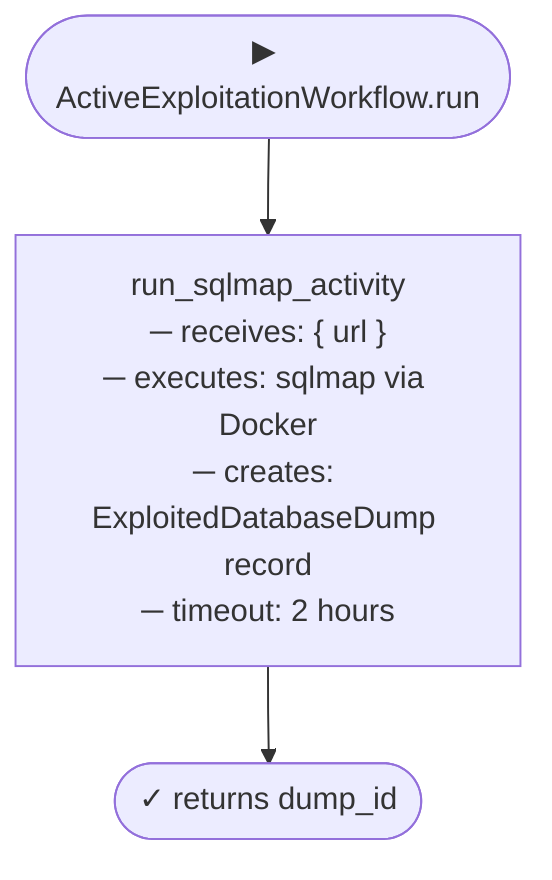

<p align="center">
<a href="https://rengine.wiki"></a>
</p>

<p align="center">
  <h4 align="center"><strong>r3ngine Plugin · Active Exploitation</strong></h4>
  <h3 align="center">Automated SQL Injection Database Extraction & Secure Dump Management</h3>
</p>

<p align="center">
  <a href="#" target="_blank">
    
  </a>
  &nbsp;
  <a href="#" target="_blank">
    
  </a>
  &nbsp;
  <a href="#" target="_blank">
    
  </a>
  &nbsp;
  <a href="https://www.gnu.org/licenses/gpl-3.0" target="_blank">
    
  </a>
</p>


> ⚠️ **Authorisation Required**
>
> This plugin performs active exploitation against target systems. It must only be used against systems for which you have explicit, written authorisation. Unauthorised use is illegal. The r3ngine project and its contributors accept no liability for misuse.


## About

The **Active Exploitation** plugin extends the r3ngine scan pipeline beyond discovery and vulnerability identification into controlled, post-scan exploitation. It integrates **sqlmap** to perform SQL injection attacks against vulnerable endpoints identified by the core Nuclei scanner, extracts database contents, and stores the results as encrypted, access-controlled dump records.

The plugin triggers automatically after the `vulnerability_scan` tier completes, receiving a list of SQL-injectable URLs as input. Dump contents are encrypted at rest, masked in the UI by default, and can only be unmasked or deleted by authenticated users.


## Table of Contents

* [Features](#features)
* [Tools & Dependencies](#tools--dependencies)
* [Data Model](#data-model)
* [REST API](#rest-api)
* [Temporal Workflow](#temporal-workflow)
* [Configuration](#configuration)
* [UI Overview](#ui-overview)
* [Building the UI](#building-the-ui)


## Features

### 💉 Automated SQL Injection Exploitation
*   **sqlmap Integration**: Executes sqlmap via Docker image (`ghcr.io/sqlmapproject/sqlmap`) with `--batch --random-agent` to ensure non-interactive, OpSec-aware operation.
*   **Pipeline Triggered**: Runs automatically after the r3ngine `vulnerability_scan` tier — no manual URL entry required for scan-discovered targets.
*   **Manual Trigger**: The UI also supports on-demand exploitation runs for ad-hoc targets outside the main pipeline.
*   **Deep Extraction**: Configured to dump all accessible databases, tables, and rows in a single run.

### 🔐 Secure Dump Storage
*   **Encrypted At Rest**: All raw dump contents are written to a zip archive referenced by an encryption key ID. Plaintext is never written to the database.
*   **UI Masking**: Dump payload visibility is toggled per-record (`is_masked`). New records default to masked — analysts must explicitly unmask to view raw content.
*   **Audit Trail**: Every mask/unmask and delete action is associated with the authenticated user session.

### 📊 Exploitation Dashboard
*   **Aggregate Metrics**: Exploited target count, total extracted tables, total extracted rows, and high-exposure leak count (>1,000 rows extracted) displayed as live KPI cards.
*   **Dump Queue Table**: Sortable list of all exploitation runs with target URL, DBMS engine fingerprint, table/row counts, and masking status.
*   **Detail Panel**: Click any dump to inspect cryptographic metadata (key reference, zip path), toggle masking, download the archive, or purge the record.


## Tools & Dependencies

| Tool | Purpose | Source |
|------|---------|--------|
| `sqlmap` | SQL injection detection and database extraction | Docker: `ghcr.io/sqlmapproject/sqlmap` |

The tool is declared in [`tools.yaml`](tools.yaml) and is pulled and validated automatically by the r3ngine plugin loader at startup. No manual installation is required beyond having Docker available.

```yaml
# tools.yaml
tools:
  - name: "sqlmap"
    description: "Automatic SQL injection and database takeover tool."
    docker_image: "ghcr.io/sqlmapproject/sqlmap"
    command: "-u {url} --batch --random-agent"
```


## Data Model

A single model backs the plugin, stored in the `plugin_active_exploitation_db_dump` table.

```python
class ExploitedDatabaseDump(models.Model):
    url               # Target URL that was exploited
    db_type           # DBMS fingerprint (e.g. "MySQL", "PostgreSQL")
    extracted_tables  # Number of tables successfully dumped
    extracted_rows    # Total rows extracted across all tables
    zip_path          # Filesystem path to the encrypted dump archive
    encryption_key_reference  # Key ID used to encrypt the archive
    is_masked         # Whether the UI shows or hides dump content (default True)
    created_at        # Timestamp of exploitation run
```


## REST API

All endpoints are mounted under `/api/plugins/active_exploitation/`.

| Method | Endpoint | Description |
|--------|----------|-------------|
| `GET` | `dumps/` | List all exploitation dump records |
| `POST` | `dumps/` | Create a dump record (used internally by the workflow) |
| `GET` | `dumps/{id}/` | Retrieve a single dump record |
| `DELETE` | `dumps/{id}/` | Permanently purge a dump record and its archive |
| `POST` | `dumps/{id}/toggle_mask/` | Toggle `is_masked` on a dump record |

All endpoints require authentication (`IsAuthenticated`). Responses follow standard DRF JSON structure.

**Example — toggle mask:**
```json
POST /api/plugins/active_exploitation/dumps/3/toggle_mask/

Response:
{
  "status": "success",
  "is_masked": false
}
```


## Temporal Workflow

The plugin registers one workflow and one activity on the `python-orchestrator-queue`.



**Starting a workflow from the API:**

```python
from reNgine.temporal_client import TemporalClientProvider

handle = await client.start_workflow(
    "ActiveExploitationWorkflow",
    {"url": "https://target.example.com/vuln?id=1"},
    id="active-exploitation-<target>",
    task_queue="python-orchestrator-queue",
)
```

The workflow is typically invoked by the core r3ngine `MasterScanWorkflow` when `run after: vulnerability_scan` is satisfied and the scan engine YAML enables the exploitation step.


## Configuration

The plugin has no dedicated configuration endpoint. Behaviour is controlled by the sqlmap command in `tools.yaml` and the scan engine YAML block:

```yaml
# In your scan engine YAML configuration
vulnerability_scan:
  run_nuclei: true
  severities: ['high', 'critical']

# Enables active exploitation of confirmed SQLi findings
active_exploitation:
  enabled: true
  max_rows: 10000       # Safety limit on extracted rows per target
  dump_format: "zip"    # Output format for raw dump archive
```

> **Note**: The `max_rows` and `dump_format` keys are read by the activity at runtime. If the block is absent, the activity uses its built-in defaults.


## UI Overview

The plugin UI is accessible from the r3ngine sidebar under **Active Exploitation**. It is loaded via Vite Module Federation and mounts its own isolated React + MUI tree.

| Section | Description |
|---------|-------------|
| **KPI Header** | Exploited targets, extracted tables, extracted rows, high-exposure leak count |
| **Dump Queue** | Scrollable table of all runs — click a row to open the detail panel |
| **Detail Panel** | Cryptographic metadata, mask/unmask toggle, download archive, purge record |
| **Manual Trigger** | "Run Manual Exploit" button initiates an on-demand sqlmap run |

The UI uses a `#ec00ff` magenta accent on a `#07070c` near-black background, consistent with the r3ngine cyberpunk design language.


## Building the UI

```bash
cd active_exploitation/ui
npm install
npm run build
```

This produces `dist/assets/remoteEntry.js` (the Vite Module Federation entry point loaded by `PluginPageLoader`) and `dist/assets/__federation_expose_Mount-*.js`.

Sync to the running container:

```bash
docker exec r3ngine-web-1 python manage.py sync_plugin_ui active_exploitation
# or manually:
docker cp dist/. r3ngine-web-1:/app/staticfiles/plugins/active_exploitation/
```

Apply migrations (first install only):

```bash
docker exec r3ngine-web-1 python manage.py migrate active_exploitation_backend
```


<p align="right"><i>Note: Parts of this README were written or refined using AI language models.</i></p>
