# Burp Suite Professional Integration Plugin for r3ngine

The Burp Suite integration plugin provides a self-contained extension to synchronize vulnerability scan results and target scope settings between a local/remote Burp Suite Professional instance and r3ngine.

---

## 1. Prerequisites & Burp Setup

The plugin communicates with the **Burp Suite Professional REST API**. Burp Suite Community Edition does not include this API.

### 1.1. Enable Burp REST API
1. Open Burp Suite Professional.
2. Navigate to **User options** → **Misc** → **REST API**.
3. Check the box **Service running**.
4. Configure the listener port:
   - **Default port**: `1337`
   - **Listen on loopback interface only** (default): Only processes on the local machine can connect. If r3ngine runs in Docker, you may need to bind to **All interfaces** or configure port forwarding/bridging.
5. **API Keys** (Optional but Recommended):
   - By default, Burp REST API does not require authentication. 
   - You can generate an API key in Burp's settings and configure it in r3ngine settings to secure the endpoint.

---

## 2. Docker Networking Configuration

If r3ngine runs inside Docker and Burp Suite runs on the host desktop environment:

### 2.1. Connecting from Docker to Desktop Host
The Burp REST API binds to `127.0.0.1:1337` on the host machine. Docker containers cannot reach the host via `127.0.0.1` because that points to the container's own loopback interface.

- **Windows/macOS (Docker Desktop)**: Use `http://host.docker.internal:1337` as the API URL in r3ngine. Docker Desktop automatically resolves this hostname to the host machine.
- **Linux**: By default, `host.docker.internal` is not available on Linux. You can:
  1. Add `--add-host=host.docker.internal:host-gateway` to your docker run / docker-compose command.
  2. Or use the IP address of the `docker0` bridge (typically `172.17.0.1:1337`).
  3. Ensure Burp's REST API is configured to listen on **All interfaces** or the specific docker bridge IP, rather than just `127.0.0.1`.
  4. Ensure your local firewall allows inbound connections on port 1337 from the Docker subnet (`172.16.0.0/12` or `172.17.0.0/16`).

---

## 3. Core Architecture & Two-Phase Correlation

To protect database integrity and handle network latency safely, the import workflow is split into two asynchronous phases managed by Temporal.

```mermaid
sequenceDiagram
    participant B as Burp Pro REST API
    participant T as Temporal Worker
    participant DB as Postgres Database
    participant V as startScan.Vulnerability

    rect rgb(20, 20, 30)
    Note over T,DB: Phase 1: Raw Import
    T->>B: GET /v0.1/scan/.../issues
    B-->>T: Return Issues JSON
    T->>DB: Bulk save/update in plugin_burpsuite_integration_issue
    end

    rect rgb(30, 20, 30)
    Note over T,V: Phase 2: Correlation
    T->>DB: Query uncorrelated BurpIssue records
    T->>DB: Look up Subdomain/EndPoint matching issue host/path
    alt Match Found
        T->>V: Create/Update Vulnerability (linked)
        T->>DB: Set linked_vulnerability_id & is_correlated=True
    else No Match
        T->>DB: Set is_correlated=True, linked_vulnerability_id=Null (Unmatched)
    end
    end
```

### 3.1. Phase 1: Raw Import (`run_burp_import_activity`)
- Queries Burp Suite's `/v0.1/scan/{task_id}/issues` (or iterates all tasks if no task ID is specified).
- Saves raw findings into the plugin-owned `BurpIssue` table.
- Identifies duplicates using Burp's `burp_serial_number` field.
- Mapped severities:
  - `information` → `0` (Info)
  - `low` → `1` (Low)
  - `medium` → `2` (Medium)
  - `high` → `3` (High)
  - `critical` → `4` (Critical)

### 3.2. Phase 2: Correlation (`run_burp_correlate_activity`)
- Iterates over newly imported `BurpIssue` records where `is_correlated=False`.
- Queries the core r3ngine database to match the issue `host` against existing `Subdomain` hostnames, and the issue `path` against `EndPoint` records.
- Creates or updates a core `startScan.Vulnerability` record if a match is found.
- If no subdomain matches, the issue is kept as **Unmatched**. Unmatched findings are displayed in the dashboard and can be manually correlated via the UI.

---

## 4. Manual Correlation Interface

In some cases, Burp may discover a vulnerability on a host or path that is not yet registered in r3ngine's asset index (e.g. dynamic endpoints discovered during spidering).

1. Navigate to the **Scan Issues** tab.
2. Check the **Unmatched Only** filter.
3. Select an issue and click **Match**.
4. In the dialog:
   - Use the **Target Subdomain** autocomplete search box to find the correct r3ngine asset.
   - (Optional) Use the **Endpoint** autocomplete search box to narrow the finding down to a specific page or route.
5. Click **Confirm Correlation**. The system creates the vulnerability record, links the `BurpIssue`, and removes it from the unmatched filter view.

---

## 5. Temporal Workflows

Workflows are registered with the central Temporal orchestrator and run asynchronously.

### 5.1. `BurpSuiteWorkflow` (Import)
- Runs `run_burp_import_activity` followed by `run_burp_correlate_activity`.
- Re-correlation can be triggered manually from the UI to re-evaluate unmatched issues against new reconnaissance assets without talking to the Burp REST API again.

### 5.2. `BurpPushWorkflow` (Push Scope)
- Loads all subdomains and endpoints for the current scan context.
- Formats them as scope rule items.
- Sends a `POST` request to Burp's `/v0.1/target/scope` endpoint to dynamically add the discovered assets to Burp's target definition.
