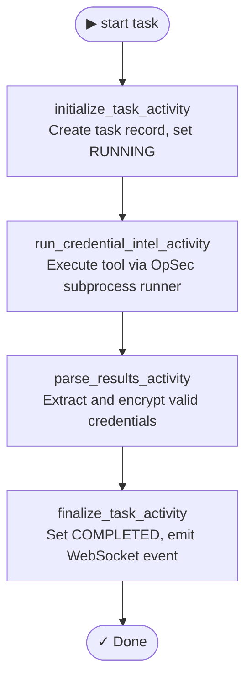

<p align="center">
<a href="https://rengine.wiki"></a>
</p>

<p align="center">
  <h4 align="center"><strong>r3ngine Plugin · Credential Intelligence</strong></h4>
  <h3 align="center">Advanced authentication testing, password auditing, and credential harvesting</h3>
</p>

<p align="center">
  <a href="#" target="_blank">
    
  </a>
  &nbsp;
  <a href="#" target="_blank">
    
  </a>
  &nbsp;
  <a href="https://www.gnu.org/licenses/gpl-3.0" target="_blank">
    
  </a>
</p>

<p align="center">
  
</p>


## About

The **Credential Intelligence** plugin is a dedicated assessment environment for credential testing, authentication brute-forcing, and offline password cracking. It integrates industry-standard tools (brutus, netexec, kerbrute, hashcat) natively into the r3ngine interface.


## Table of Contents

* [Features](#features)
* [Tools & Dependencies](#tools--dependencies)
* [REST API](#rest-api)
* [Temporal Workflow](#temporal-workflow)
* [Configuration](#configuration)
* [UI Overview](#ui-overview)
* [Building the UI](#building-the-ui)


## Features

### 🔐 Authentication Testing
*   **Web Auth**: Execute brutus for HTTP basic auth and form-based authentication testing.
*   **Network Auth**: Run NetExec (SMB, WMI, SSH) to validate credentials across internal and external infrastructure.
*   **Active Directory Auth**: Perform Kerberos pre-auth brute forcing with Kerbrute.
*   **Offline Cracking**: Integrated Hashcat support for offline hash cracking with standard wordlists.

### 🛡️ Secure Execution (OpSec)
*   **Command Sanitization**: Strict subprocess command list construction via `shlex` and typed parameters to prevent injection.
*   **Isolated Sandboxing**: Executes tools via Temporal workers within isolated environments.
*   **Artifact Cleanup**: Temporary payloads and credential dumps are securely unlinked upon task completion.

### 📊 Real-Time Reporting
*   **Encrypted Storage**: Credentials and sensitive findings are encrypted at rest using `EncryptedCharField`.
*   **Live Dashboard**: Interactive UI dashboard for monitoring active cracking and bruteforce tasks.
*   **Rate Limiting**: Integrated `IsAuthenticated` gating and `10/min` throttling for API security.


## Tools & Dependencies

| Tool | Purpose | Install |
|------|---------|---------|
| `netexec` | SMB, WMI, SSH auth testing | `pipx install git+https://github.com/Pennyw0rth/NetExec` |
| `kerbrute` | Active Directory Kerberos auth | `wget` (pre-compiled binary) |
| `hashcat` | Offline hash cracking | `apt-get install hashcat` |
| `brutus` | Web authentication testing | Built-in |

Tools are registered in [`tools.yaml`](tools.yaml) and installed automatically by the r3ngine plugin loader at container startup. No manual installation is required.


## REST API

All endpoints are mounted under `/api/plugins/credential_intelligence/`.

| Method | Endpoint | Description |
|--------|----------|-------------|
| `GET/POST` | `tasks/` | List or create credential assessment tasks. |
| `GET` | `tasks/{id}/` | Retrieve task details and status. |
| `POST` | `tasks/{id}/start/` | Launch Temporal workflow for execution. |
| `GET` | `discovered/` | View decrypted, discovered credentials. |


## Temporal Workflow

The assessment lifecycle runs as a Temporal workflow on the `python-orchestrator-queue`.




## Configuration

Settings are managed via the web UI when creating a new task:
- Target (URL/IP/Domain)
- Tool Selection
- User & Password Wordlists
- Concurrency / Threads
- Additional CLI Flags


## UI Overview

The plugin UI is a React 18 + MUI application loaded via Vite Module Federation. It is accessible from the r3ngine sidebar under **Credential Intel**.

| View | Description |
|------|-------------|
| **Dashboard** | Glassmorphism-styled dashboard showing active tasks, success rates, and live configuration panels. |
| **Task Configuration** | Form for creating new testing tasks. |


## Building the UI

```bash
cd credential_intelligence/ui
npm install
npm run build
```

This produces `dist/assets/remoteEntry.js` (the Vite Module Federation entry point) and `dist/assets/__federation_expose_Mount-*.js` (the mounted React tree).

Sync to the running container:

```bash
docker exec r3ngine-web-1 python manage.py sync_plugin_ui credential_intelligence
```

Apply migrations:

```bash
docker exec r3ngine-web-1 python manage.py migrate credential_intelligence_backend
```


<p align="right"><i>Note: Parts of this README were written or refined using AI language models.</i></p>
