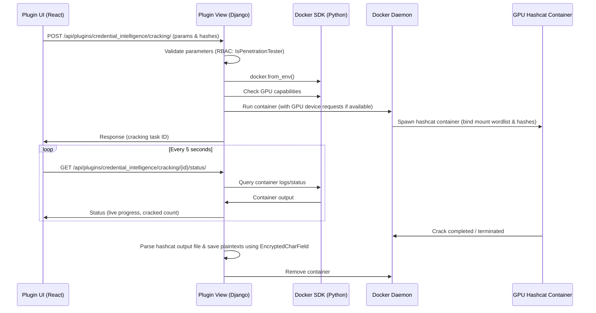

# Offline Cracking Architectural Diagram

The diagram below shows the interaction flow between the frontend UI, Django views, the Docker SDK, the host daemon, and the containerized Hashcat instances.

## Security Controls

1. **Parameter Sanitization**: No raw shell strings are passed to the container. All configurable Hashcat command-line parameters (workload, attack mode, charsets, increment configurations) are mapped directly via Python lists to avoid shell injection.
2. **Access Control**: Creation and control of cracking tasks are restricted to the `IsPenetrationTester` role. Results containing cracked cleartext credentials require the `IsAuditor` role to retrieve.
3. **Container Sandbox**: The Hashcat container runs as a non-root processes, using CPU/Memory constraints to prevent host DoS.
