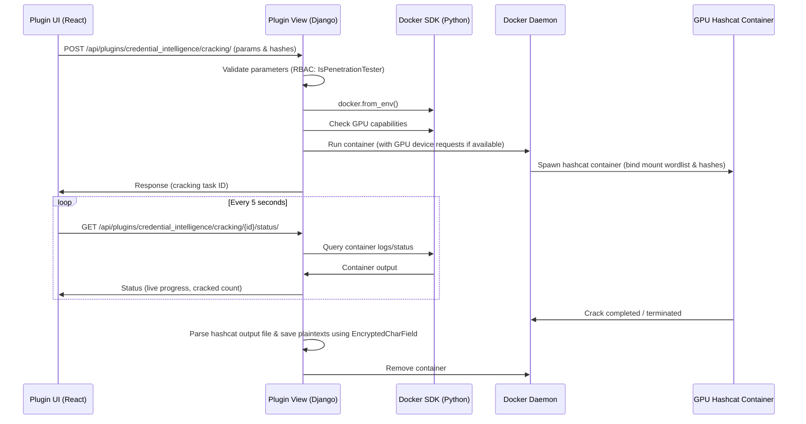

# Credential Intelligence Plugin

## Overview
The **Credential Intelligence** plugin is an advanced auditing tool that aggregates and manages credential-based attacks, seamlessly tying into the `r3ngine` core plugin ecosystem. It allows for orchestrated tasks utilizing well-known security tools (e.g., Brutus, NetExec, Kerbrute, Hashcat) with strong OpSec guarantees.

## Architecture & OpSec Execution Flow

This plugin offloads task execution to the backend using Temporal workflows. Execution flows are designed to remain stealthy, inheriting constraints directly from `r3ngine`'s OpSec configuration layer:
1. **Frontend Task Creation:** User defines target, wordlists, threading limits, and stealth flags.
2. **Temporal Workflow Activation:** The `run_credential_intel_activity` is scheduled on the worker node.
3. **OpSec Enforcement:** The activity wraps the chosen security tool inside `CredentialOpSecManager`, enforcing strict TOR routing, exit node rotation, and traffic obfuscation to avoid detection.
4. **Execution and Parsing:** The wrapped tool runs, output is parsed in real time or upon completion, and parsed results are stored in the database.

### Offline Cracking Container Lifecycle

For offline hash cracking, the system bypasses Temporal and spins up a dedicated container using the Docker SDK:

## Supported Tools
The plugin provides wrappers and integrations for the following primary tools:
- **Brutus:** Web authentication bruteforcing (HTTP Basic/Form).
- **NetExec:** SMB, WMI, and SSH spraying/auditing across internal subnets.
- **Kerbrute:** Stealthy Active Directory user enumeration and password guessing.
- **Hashcat:** Offline password hash cracking operations.

## Database Schema

The plugin maintains its state in a dedicated app schema (`credential_intelligence_backend`):
- `CredentialTask`: Represents a scheduled or running credential operation. Stores parameters such as target, tool, wordlists, and status.
- `DiscoveredCredential`: Represents the successful outcome of a task. Stores the compromised username, password/hash, and the specific target system.

## Frontend Integration

The UI is built using React and Material-UI and dynamically loaded into the `r3ngine` Shell dashboard via the `manifest.yaml` `entry_export` mapping. The interface allows users to list historic and active tasks, and features a "New Task" wizard that emphasizes the underlying OpSec protections dynamically.
