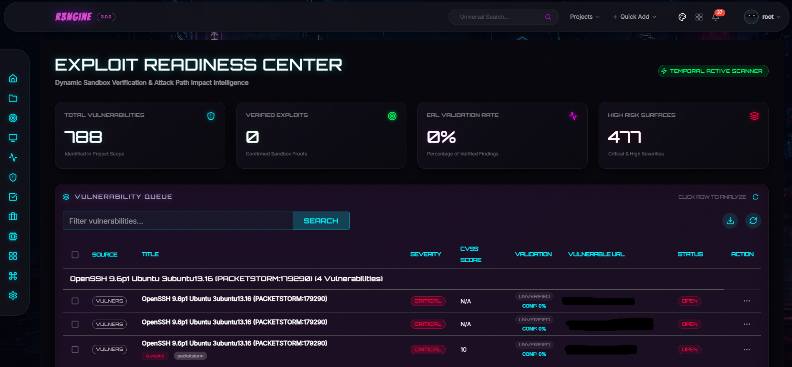
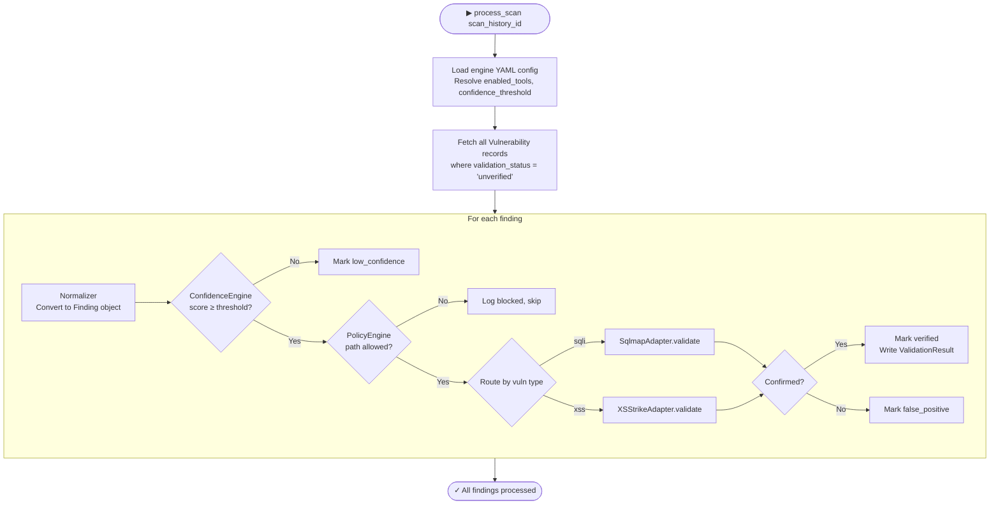
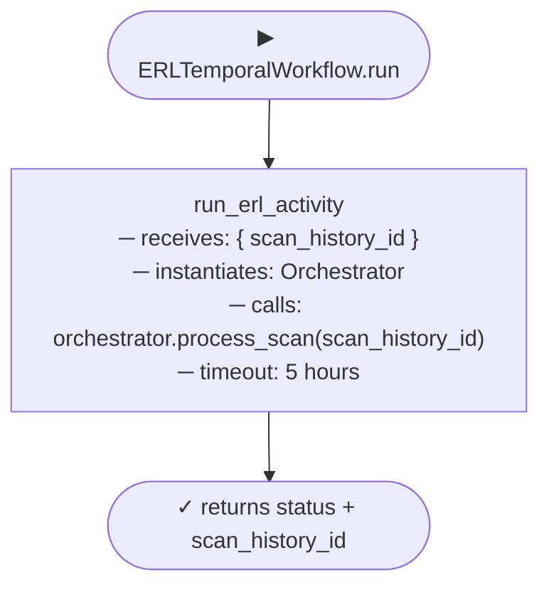

<p align="center">
<a href="https://rengine.wiki"></a>
</p>

<p align="center">
  <h4 align="center"><strong>r3ngine Plugin · Exploit Readiness Layer</strong></h4>
  <h3 align="center">Hardened Non-Destructive Vulnerability Validation with Confidence Scoring & Policy Enforcement</h3>
</p>

<p align="center">
  <a href="#" target="_blank">
    
  </a>
  &nbsp;
  <a href="#" target="_blank">
    
  </a>
  &nbsp;
  <a href="#" target="_blank">
    
  </a>
  &nbsp;
  <a href="https://www.gnu.org/licenses/gpl-3.0" target="_blank">
    
  </a>
</p>

<p align="center">
  
</p>


> ⚠️ **Authorisation Required**
>
> This plugin actively probes target systems to confirm vulnerability exploitability. It must only be used against systems for which you have explicit, written authorisation. The r3ngine project and its contributors accept no liability for misuse.


## About

The **Exploit Readiness Layer (ERL)** is r3ngine's hardened automated vulnerability confirmation engine. Where the core Nuclei scanner identifies *potential* vulnerabilities, the ERL validates whether they are *actually exploitable* — without causing damage or triggering destructive side-effects.

The ERL sits between discovery and reporting. After the core scan pipeline completes, it ingests all `unverified` vulnerability records, applies a multi-stage confidence scoring model, checks each finding against a safety policy engine, and dispatches the appropriate validation tool (sqlmap for SQLi, XSStrike for XSS). Confirmed findings are promoted to `verified`; false positives are marked `false_positive`.


## Table of Contents

* [Features](#features)
* [Tools & Dependencies](#tools--dependencies)
* [Internal Architecture](#internal-architecture)
* [Confidence Engine](#confidence-engine)
* [Policy Engine](#policy-engine)
* [REST API](#rest-api)
* [Temporal Workflow](#temporal-workflow)
* [Configuration](#configuration)
* [UI Overview](#ui-overview)
* [Building the UI](#building-the-ui)


## Features

### 🔬 Non-Destructive Validation
*   **Adapter-Based Tool Dispatch**: Each vulnerability type is validated by a dedicated adapter class (`SqlmapAdapter`, `XSStrikeAdapter`). Adapters are sandboxed and never share state between findings.
*   **Destructive Path Blacklist**: The `PolicyEngine` blocks validation against paths matching a hardcoded blacklist (`/login`, `/logout`, `/admin`, `/delete`, `/reset`, `/register`, `/signup`, `/change-password`, `/forgot-password`). These are never probed, regardless of scan engine configuration.
*   **Rate-Limiting Kill Switch**: Configurable maximum requests-per-second (`max_rps`, default 5) per target. If the error rate for a target exceeds the `error_threshold` (default 30%), the kill switch fires and all further probes for that target are aborted.

### 🧮 Confidence Scoring
*   **Pre-Validation Scoring**: Before dispatching any tool, the `ConfidenceEngine` computes a 0.0–1.0 confidence score from four weighted signals: scanner confidence (40%), reflection potential (20%), error surface (20%), and technology match (20%).
*   **Threshold Gating**: Only findings above `confidence_threshold` (default 0.5, configurable per scan engine) proceed to active validation. Low-confidence findings are marked `low_confidence` without network activity.

### 🛡️ Safety Policy Enforcement
*   **Centralised `PolicyEngine`**: All findings pass through `PolicyEngine.is_allowed()` before any tool is dispatched. Returns `(False, reason)` for blocked findings, which are logged and skipped without error.
*   **Resource Limits**: CPU, memory, and RPS ceilings enforced at the `SubprocessExecutor` level for each tool invocation.

### 📋 Validated Finding Lifecycle
*   **Status Transitions**: `unverified` → `verified` (confirmed exploitable) or `false_positive` (not exploitable) or `low_confidence` (below threshold).
*   **ValidationResult Records**: For each confirmed finding, a `ValidationResult` record is written with the tool used, raw output, and exploitability verdict.
*   **Scan History Integration**: All validation activity is tied to the originating `ScanHistory` record, so findings remain correlated to their parent scan.


## Tools & Dependencies

| Tool | Purpose | Install |
|------|---------|---------|
| `sqlmap` | SQL injection confirmation — safe read-only probe mode | `pip3 install sqlmap` |
| `XSStrike` | XSS exploitability confirmation | `git clone https://github.com/s0md3v/XSStrike.git` |

Tools are declared in [`tools.yaml`](tools.yaml) and installed automatically by the r3ngine plugin loader at container startup.

```yaml
# tools.yaml
tools:
  - name: "sqlmap"
    binary: "sqlmap"
    install_type: "pip3"
    install_command: "pip3 install sqlmap"
    validation_command: "sqlmap --version"

  - name: "XSStrike"
    binary: "python3 /usr/src/app/plugins_data/exploit_readiness_layer/tools/XSStrike/xsstrike.py"
    install_type: "git"
    install_command: "mkdir -p tools && git clone --depth 1 https://github.com/s0md3v/XSStrike.git tools/XSStrike && pip3 install -r tools/XSStrike/requirements.txt"
    validation_command: "python3 tools/XSStrike/xsstrike.py --version"
```


## Internal Architecture

The ERL backend is structured as a layered engine inside `backend/erl/`:

```
backend/erl/
├── core/
│   ├── orchestrator.py        # Entry point — drives the full validation pipeline
│   ├── confidence_engine.py   # Pre-validation confidence scoring (0.0–1.0)
│   ├── policy_engine.py       # Safety policy gate — blacklists, rate limits, kill switch
│   ├── normalizer.py          # Normalises scanner output into Finding objects
│   └── subprocess_executor.py # Sandboxed tool execution with resource limits
├── adapters/
│   ├── base_adapter.py        # Abstract base — defines the adapter contract
│   ├── sqlmap_adapter.py      # sqlmap adapter for SQLi validation
│   └── xsstrike_adapter.py    # XSStrike adapter for XSS validation
├── config/                    # Engine configuration loading
├── evidence/                  # Evidence capture and artefact storage
├── models/                    # Adapter-level data structures
└── sandbox/                   # Sandboxing utilities for subprocess isolation
```

### Orchestrator Pipeline




## Confidence Engine

The `ConfidenceEngine` computes a pre-validation score from four weighted signals:

| Signal | Weight | Source |
|--------|--------|--------|
| Scanner confidence | 40% | Nuclei/scanner-reported confidence value |
| Reflection potential | 20% | Whether the vuln type can reflect user input |
| Error surface | 20% | Presence of error-indicative strings in the finding |
| Technology match | 20% | Whether the target tech stack matches known vuln patterns |

Findings with a combined score below `confidence_threshold` are marked `low_confidence` and skipped without network activity. This prevents wasting tool cycles on low-signal findings.


## Policy Engine

The `PolicyEngine` enforces hard safety boundaries before any tool invocation:

**Path Blacklist** (never probed, regardless of config):

```
/login  /logout  /admin  /delete  /reset
/register  /signup  /change-password  /forgot-password
```

**Rate Limits** (per-target, configurable):

| Setting | Default | Description |
|---------|---------|-------------|
| `max_rps` | `5` | Maximum requests per second per target |
| `max_cpu` | `0.5` | CPU fraction ceiling for tool subprocess |
| `max_mem` | `256m` | Memory ceiling for tool subprocess |
| `error_threshold` | `0.3` | Error rate above which the kill switch fires |

When `is_allowed()` returns `(False, reason)`, the finding is logged with the denial reason and skipped — no exception is raised and processing continues with the next finding.


## REST API

The ERL plugin does not expose its own API endpoints — it reads from and writes to the core r3ngine `Vulnerability` and `ValidationResult` models directly via Django ORM. Results are visible in the core vulnerability views immediately after the workflow completes.

The plugin workflow is started through the core scan engine API:

```
POST /api/startScan/
{
  "scan_history_id": 42,
  "scan_type": "erl"
}
```

Or triggered automatically when the scan engine YAML includes:

```yaml
erl:
  enabled: true
```


## Temporal Workflow

The plugin registers one workflow and one activity on the `python-orchestrator-queue`.



The 5-hour `start_to_close_timeout` accommodates large scans with hundreds of unverified findings, where each finding may require multiple tool invocations.

**Workflow registration** (`manifest.yaml`):

```yaml
temporal:
  workflows:
    - "backend.temporal_exports.ERLTemporalWorkflow"
  activities:
    - "backend.temporal_exports.run_erl_activity"
```


## Configuration

ERL behaviour is controlled entirely through the scan engine YAML. The default engine fixture (`erl_engine.yaml`) ships with the plugin:

```yaml
erl:
  enabled: true
  use_tools:
    - sqlmap
    - XSStrike
  confidence_threshold: 0.5   # 0.0–1.0; findings below this are skipped

# ERL uses these upstream scan steps to source unverified findings:
subdomain_discovery:
  uses_tools: [subfinder, chaos]
  threads: 30
http_crawl: {}
vulnerability_scan:
  run_nuclei: true
  run_dalfox: true
  severities: [high, critical]
brute_force_scan:
  services: [ssh, ftp, http]
```

**Per-finding behaviour:** The `use_tools` list controls which adapters are active. Remove `sqlmap` to skip SQLi validation; remove `XSStrike` to skip XSS validation.

**Policy overrides** are not currently exposed via YAML — they are hardcoded in `PolicyEngine` to ensure safety guarantees cannot be accidentally relaxed by configuration drift.


## UI Overview

The plugin UI is accessible from the r3ngine sidebar under **Exploit Readiness**. It is loaded via Vite Module Federation and mounts its own isolated React + MUI tree.

| Section | Description |
|---------|-------------|
| **KPI Header** | Validated findings count, confirmed exploitable, false positive rate, low-confidence skipped |
| **Vulnerability Table** | All findings from the parent scan with validation status badges — `verified`, `false_positive`, `low_confidence`, `unverified` |
| **Tactical Panel** | Per-finding detail: confidence score, policy decision, tool used, raw tool output |
| **Impact Explorer** | Cytoscape.js graph visualising exploitability chains across the attack surface |

The UI uses a `#00f3ff` cyan accent on a `#07070c` near-black background, consistent with the r3ngine cyberpunk design language.


## Building the UI

```bash
cd exploit_readiness_layer/ui
npm install
npm run build
```

This produces `dist/assets/remoteEntry.js` (the Vite Module Federation entry point loaded by `PluginPageLoader`) and `dist/assets/__federation_expose_Mount-*.js`.

Sync to the running container:

```bash
docker exec r3ngine-web-1 python manage.py sync_plugin_ui exploit_readiness_layer
# or manually:
docker cp dist/. r3ngine-web-1:/app/staticfiles/plugins/exploit_readiness_layer/
```

No additional migrations are required — the ERL writes to the core `Vulnerability` and `ValidationResult` models in the main schema.

Run plugin tests:

```bash
docker exec r3ngine-web-1 python manage.py test plugins_data.exploit_readiness_layer.tests
```


<p align="right"><i>Note: Parts of this README were written or refined using AI language models.</i></p>
