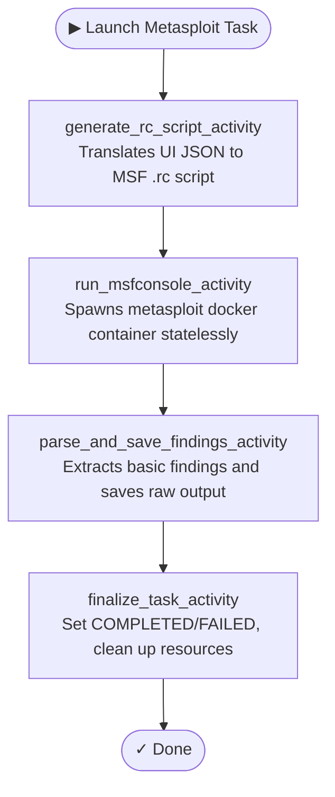

<p align="center">
<a href="https://rengine.wiki"></a>
</p>

<p align="center">
  <h4 align="center"><strong>r3ngine Plugin · Metasploit Integration</strong></h4>
  <h3 align="center">Standalone Metasploit Orchestration & Interactive Exploit Console</h3>
</p>

<p align="center">
  <a href="#" target="_blank">
    
  </a>
  &nbsp;
  <a href="#" target="_blank">
    
  </a>
  &nbsp;
  <a href="#" target="_blank">
    
  </a>
  &nbsp;
  <a href="https://www.gnu.org/licenses/gpl-3.0" target="_blank">
    
  </a>
</p>

<p align="center">
  
</p>


## About

The **Metasploit Integration** plugin brings the power of the Metasploit Framework directly into r3ngine. Designed as a strict, standalone execution environment, it is kept entirely decoupled from the core r3ngine vulnerability pipeline to prevent destabilizing host instances with heavy Ruby dependencies or crashing primary scan cycles. 

It provides an end-to-end orchestration flow: launch automated scan modules via Temporal tasks with resource scripts, and interact with the Metasploit engine natively using a WebSocket-backed, 2-way interactive xterm.js terminal embedded in your browser.


## Table of Contents

* [Features](#features)
* [Tools & Dependencies](#tools--dependencies)
* [Data Model](#data-model)
* [Temporal Workflow](#temporal-workflow)
* [REST API & WebSockets](#rest-api--websockets)
* [Security & Isolation](#security--isolation)
* [UI Overview](#ui-overview)
* [Building the UI](#building-the-ui)


## Features

### 🐳 Stateless Container Orchestration
*   **Docker-Native**: Runs the official `metasploitframework/metasploit-framework` Docker image dynamically, keeping the r3ngine host clean and dependency-free.
*   **Automated Resource Scripts**: Dynamically translates user UI inputs into stateless Metasploit `.rc` files for non-interactive task automation.

### 🎯 Automated Task Execution
*   **Module Targeting**: Execute any Metasploit module (auxiliary, exploit, post) against target arrays seamlessly from the UI.
*   **Temporal Automation**: Workflows are processed asynchronously, capturing and saving both structured findings and raw `stdout`/`stderr` outputs into isolated plugin tables.

### 💻 2-Way Interactive Terminal
*   **Live Web Console**: A dockable, fully interactive `xterm.js` terminal.
*   **PTY WebSockets**: Powered by Django Channels and Python pseudo-terminals (`pty`), offering a seamless, stable MSF interactive experience straight from the browser.
*   **Hands-on Validation**: Analyze results on your dashboard, then pop open the auxiliary console to manually validate findings against targets.
*   **Kill Switch Control**: Instantly terminate and clean up hanging or unneeded console sessions via the Docker SDK.

### 🔒 Zero-Trust Security Boundaries
*   **Strict RBAC**: Operations are restricted exclusively to `IsPentesterOrAdmin` rules (enforcing `is_staff` / `is_superuser` requirements).
*   **WebSocket Authentication**: Unauthenticated WebSocket connection attempts are instantly dropped before terminal allocation via `@database_sync_to_async`.


## Tools & Dependencies

| Tool | Purpose | Install |
|------|---------|---------|
| **Docker Engine** | Used to spawn ephemeral MSF instances | Provided by the host running r3ngine |
| **Metasploit Framework** | Core offensive engine | Pulled dynamically as `metasploitframework/metasploit-framework` via `tools.yaml` |

Tools are registered in [`tools.yaml`](tools.yaml) and configured automatically by the r3ngine plugin loader. No native host dependencies are required beyond the standard Docker daemon socket access.


## Data Model

All models use the `plugin_metasploit_integration_` prefix to enforce isolation from core r3ngine tables.

| Model | Purpose |
|-------|---------|
| `MetasploitWorkspace` | High-level logical grouping for tasks and projects. |
| `MetasploitTask` | Tracks automated Temporal task executions, storing parameters, target configurations, execution statuses, and complete raw console output. |
| `MetasploitFinding` | Parsed intelligence records (e.g. open ports, positive matches) extracted from task raw output logs. |


## Temporal Workflow

The automated execution lifecycle runs as a Temporal workflow on the `r3ngine-plugin-tasks` queue.




## REST API & WebSockets

All APIs are mounted under `/api/plugins/metasploit_integration/` and require Staff/Superuser authentication.

| Method | Endpoint | Description |
|--------|----------|-------------|
| `GET/POST` | `workspaces/` | Manage Metasploit logical workspaces |
| `GET/POST` | `tasks/` | Create tasks, launching automated Temporal workflows |
| `GET` | `tasks/{id}/` | Retrieve raw task output and parameters |
| `GET` | `findings/` | Query parsed Metasploit findings |

### WebSocket Interface
Mounted at `ws/plugins/metasploit_integration/terminal/`.
- Accepts authenticated WebSockets to stream byte-level I/O directly into an ephemeral `pty` attached to a live `msfconsole` process.


## Security & Isolation

To ensure maximum safety when executing offensive toolsets:
1. **Pipeline Independence**: The manifest explicitly declares `run after: "standalone"`, meaning it can never be injected into core automated scanning workflows.
2. **Frontend Boundaries**: Bundled via Vite Module Federation with `shared: []`. Frontend crashes in the plugin do not propagate to the host React DOM.


## UI Overview

Loaded via Vite Module Federation, the UI is an autonomous React 18 Application accessible under the sidebar.

| Component | Description |
|-----------|-------------|
| **Dashboard** | Visual overview of running tasks, metrics, and latest findings. |
| **Task Launcher** | Form to configure payloads, auxiliary modules, and target ranges. |
| **Terminal View** | Dockable, WebSocket-driven `xterm.js` component for 2-way MSF interaction. |


## Building the UI

```bash
cd metasploit_integration/ui
npm install
npm run build
```

This produces `dist/assets/remoteEntry.js`.

Sync to the running container:

```bash
docker exec r3ngine-web-1 python manage.py sync_plugin_ui metasploit_integration
```

Apply migrations (first install only):

```bash
docker exec r3ngine-web-1 python manage.py migrate metasploit_integration_backend
```


<p align="right"><i>Note: Parts of this README were written or refined using AI language models.</i></p>
